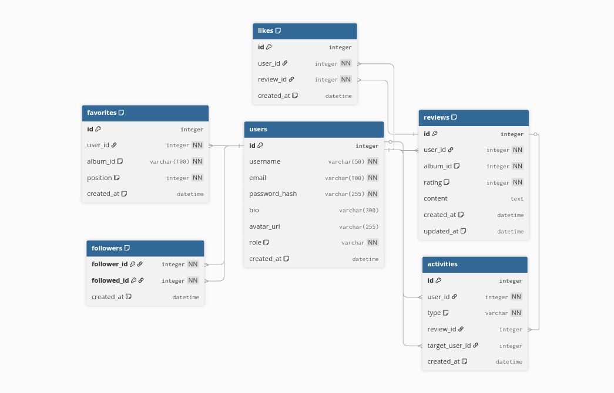

<div align="center">

# Wrapity API

REST API for [Wrapity](https://github.com/nicolasgarea/wrapity-web) — music reviews, social features, JWT auth.

[](https://python.org)
[](https://fastapi.tiangolo.com)
[](https://mysql.com)
[](https://github.com/nicolasgarea/wrapity-api/actions/workflows/ci.yml)
[](LICENSE)

</div>

<br/>

## Why this project?

One rule kept the codebase honest: routes validate and delegate, services own logic, repositories own queries — nothing crosses the boundary. Each layer is independently testable and adding a feature never requires touching code that shouldn't care about it.

Built with FastAPI, SQLAlchemy, Alembic for migrations, and httpx for async requests to the Deezer API and Cloudinary.

## Architecture

```
HTTP Request
     │
     ▼
  Routes          ← validate input, call service, return response
     │
     ▼
  Services        ← business logic, orchestration
     │
     ▼
  Repositories    ← all database queries (SQLAlchemy)
     │
     ▼
  Database        ← MySQL 8.0

  External
     ├── Deezer API      ← album and artist metadata
     └── Cloudinary      ← avatar image uploads
```

## Database



Migrations are managed with Alembic. Files live in `migrations/versions/`.

```bash
venv/bin/alembic revision --autogenerate -m "description"
venv/bin/alembic upgrade head
```

## Quick Start

**Requirements:** Python 3.12, Docker.

```bash
python -m venv venv
pip install -r requirements.txt

cp .env.example .env

docker compose up -d

venv/bin/alembic upgrade head

make seed

make run
# http://localhost:8000
```

| Command | Description |
|---|---|
| `make run` | Start dev server with hot reload |
| `make test` | Run pytest |
| `make format` | Format with Ruff |
| `make seed` | Populate the database with sample data |
| `make db_up` | Start local MySQL via Docker Compose |
| `make db_down` | Stop local MySQL |
| `make db_reload` | Restart local MySQL |
| `make fresh` | Full reset — wipe volumes, migrate, seed |

CI runs pytest, Ruff format, and Ruff lint on every push to `develop` and `main`.

## Configuration

Copy `.env.example` to `.env` and fill in the values.

| Variable | Description | Default |
|---|---|---|
| `DATABASE_URL` | SQLAlchemy connection string | `mysql+pymysql://...` |
| `SECRET_KEY` | JWT signing key | — |
| `ALGORITHM` | JWT algorithm | `HS256` |
| `ACCESS_TOKEN_EXPIRE_MINUTES` | Token expiry in minutes | — |
| `DEEZER_BASE_URL` | Deezer API base URL | `https://api.deezer.com` |
| `CLOUDINARY_CLOUD_NAME` | Cloudinary cloud name | — |
| `CLOUDINARY_API_KEY` | Cloudinary API key | — |
| `CLOUDINARY_API_SECRET` | Cloudinary API secret | — |

Generate a secret key with `openssl rand -hex 32`.

## Project Structure

```
app/
├── main.py              ← FastAPI app, CORS middleware, lifespan
├── clients/
│   ├── albums_client.py ← Deezer album and artist requests (async httpx)
│   └── cloudinary_client.py ← Avatar upload
├── core/
│   ├── config.py        ← Environment variables
│   ├── security.py      ← JWT creation/validation, bcrypt hashing
│   ├── dependencies.py  ← Auth dependencies injected into routes
│   └── exceptions.py    ← Custom exception types
├── db/
│   └── database.py      ← SQLAlchemy engine and session
├── models/              ← SQLAlchemy ORM models
├── repositories/        ← Database queries, one file per model
├── services/            ← Business logic, one file per domain
├── routes/              ← FastAPI routers, one file per domain
└── schemas/             ← Pydantic request/response schemas

migrations/
└── versions/            ← Alembic migration files

tests/
└── unit/
    └── test_favorite_service.py
```

## Roadmap

- [ ] Rate limiting per user
- [ ] Admin endpoints
- [x] Activity feed
- [x] Likes on reviews
- [x] Artist endpoints
- [x] Follow system
- [x] Favorites with ordering
- [x] JWT auth with role support
- [x] Reviews — create, update, delete
- [x] Album and artist search via Deezer
- [x] Avatar upload via Cloudinary

## License

[MIT](LICENSE)
